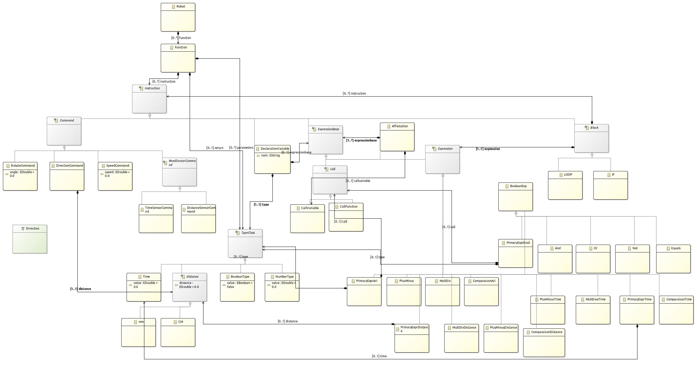
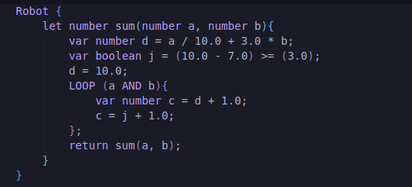
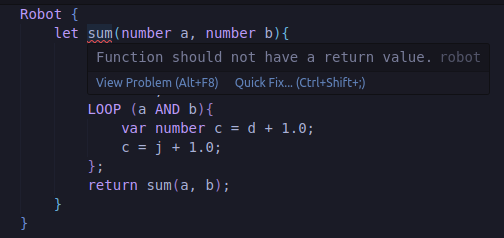
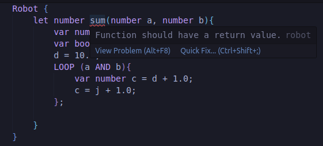
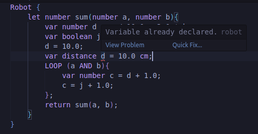
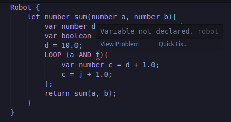
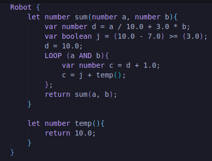
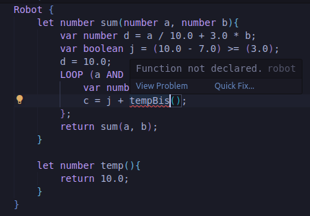
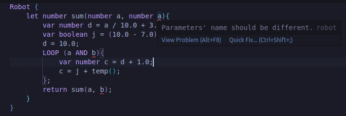

# Projet RoboML - ASE ESIR3

## 🔎 Quel est l'objectif du projet ?

Ce projet s'inscrit dans le cadre du cours Advanced Software Engineering, et consiste plus particulièrement à créer notre propre Domain-Specific Language qui sera une version alternative de RoboML, un langage permettant de contrôler le déplacement de robots. Le design de ce DSL passe par différentes étapes comme la modélisation du domaine en amont et l'implémentation des outils associés comme un éditeur de texte ou un interpréteur sous forme d'interface web avec un visuel.  

## 🚚 Les délivrables
* [Modèle Ecore](modele-eclipse/robot)
* [Transition Xtext-Langium](langiumFromXtext/langium)
* [Extension de notre langage et son implémentation](.rob)
* [Grammaire langium finale](.rob/src/language/robot.langium)

##  🔩 La modélisation



Pour ce qui est de la modélisation, notre AST se découpe selon plusieurs concepts. Tout d'abord, les fichiers de notre langage commencent toujours par Robot avec une ouverture d'accolades. 
Ces fichiers Robot sont uniquement constitués de fonctions, les fonctions commencent par le mot clé *let*, ont besoin d'un type de retour (boolean, distance, time, number ou void/aucun type), elles ont besoin d'un nom puis prennent potentiellement des paramètres, qui sont des noms de variables associés à des types de variables, et un retour lorsque nécessaire.

Ensuite, chaque ligne d'une fonction correspond à une *Instruction*. Une *Instruction* peut prendre différentes formes, il s'agit soit d'un/d'une : 
- *DeclarationVariable*, on déclare simplement une nouvelle variable dans le scope actuel, qui prend la forme : ```var type nom = [...]```
- *Affectation*, on affecte une nouvelle valeur à une variable précédemment déclarée dans le scope actuel, qui prend la forme : ```nom = [...]```
- *Block*, il s'agit des blocs conditionnels, on y retrouve les *LOOP* qui font offices de for, et les *IF* qui peuvent avoir une extension *ELSE*
- des instructions très spécifiques au contrôle des robots : *RotateCommand* pour modifier son angle, *SpeedCommand* pour modifier sa vitesse, *DirectionCommand* pour modifier la direction dans laquelle il doit se diriger, *DistanceSensorCommand*/*TimeSensorCommand* qui sont des commandes de lecture des sensors pour les robots physiques controllables via Arduino

Maintenant que nous avons défini ce qui constitue une ligne d'instruction de notre code, nous allons entrer dans les détails de ces dernières. En effet, pour définir une nouvelle variable ou affecter une nouvelle valeur par exemple il nous fallait une classe permettant de donner une valeur à ces variables, c'est le rôle des ExpressionBase. Les ExpressionBase prennent différentes formes, elles peuvent être un/une :
- *CallVariable*, on appelle une variable précédemment déclarée dans le scope actuel
- *CallFunction*, on appelle une fonction déclarée dans le fichier courant, avec la possibilité d'ajouter les paramètres, qui sont des ExpressionBase également
- *Affectation* de nouveau, ce qui permet d'écrire ```var number a = b = [...]```
- *Expression*, il s'agit des différentes expressions possibles : booléennes, arithmétiques, sur les distances, sur le temps, avec toutes les opérateurs élémentaires qui existent pour ces expressions ainsi que les comparateurs.
- les différents types existants : *NumberType*, *TimeExpression*, *DistanceExpression*, *BooleanType*. Pour donner des exemples de ces types, successivement on a : 10.0, 10.0 s, 10.0 mm ou 10.0 cm, true/false

Les *Expression* ont été constituées sous forme d'arbre dans notre grammaire (exemple avec les expressions arithmétiques) :

```
PlusMinus returns Expression:
    MultDiv ({Expression.expr1=current} operateur=('+'|'-') expr2=MultDiv)*
;

MultDiv returns Expression:
    PrimaryExprAri ({Expression.expr1=current} operateur=('*'|'/') expr2=PrimaryExprAri)*
;

PrimaryExprAri returns PrimaryExprAri:
    expr=( NumberType | CallVariable | CallFunction )
;
```

où chaque *Expression* dispose d'une partie gauche et d'une partie droite. *Expression.expr1=curent* récupère l'état courant lors du parsing, avant l'opérateur, permettant de constituer la partie gauche, tandis que le reste constitue la partie droite.

Pour ce qui est des blocs conditionnels, ces derniers ont besoin d'une *Expression* précédemment définie, *Expression* qui sera donc évaluée et qui permettra d'exécuter ou non le *Block*.
Dans ces blocs, il y a à nouveau des lignes d'*Instruction* qui doivent être rédigées, qui bénéficient du scope de la fonction actuelle, mais qui ne partagent par leur scope en dehors du *Block*.

Les interfaces énumérées se situent dans ce [fichier](.rob/src/language/robot-types.langium), et la grammaire associée dans [celui-là](.rob/src/language/robot.langium).

## ✅ Visite et validation

Pour ce qui est de cette partie, nous avons fait en sorte de rendre la visite des interfaces générées de l'AST visitable facilement où la fonction *acceptNode* prend deux paramètres, *node* et *visitor*. Elle est utilisée pour dispatcher l'appel de méthode approprié sur le visiteur en fonction du type de noeud. Elle utilise une instruction switch pour déterminer le type de noeud et appelle la méthode accept correspondante sur le visiteur. Pour donner un exemple, nous avons la classe *BooleanExp* qui implémente l'interface *ASTInterfaces.BooleanExp*. Elle possède plusieurs propriétés (*className*, *expr1*, *expr2*, *opérateur*) et un constructeur qui initialise ces propriétés. La méthode *accept* est également définie, prenant un objet *RoboMLVisitor* en paramètre et renvoyant le résultat de l'appel à la méthode *visitBooleanExp* sur le visiteur.

Pour le processus de [validation](.rob/src/language/robot-validator.ts), le but est évidemment de s'assurer qu'aucune incohérence est présente, et prévenir l'utilisateur en train de coder si quelque chose ne va pas vis-à-vis de la syntaxe ou l'état courant. Le *registerValidationChecks* est un élément vraiment (voir via l'hyperlien donnéé) car il sert à enregistrer des vérifications de validation personnalisées pour notre langage.
Il prend un objet *RobotServices* en tant que paramètre. Cet objet contient probablement divers services liés au langage Robot, notamment des services de validation. Il récupère *ValidationRegistry* et *RobotValidator* depuis l'objet *services.validation*, crée un objet *ValidationChecks* qui associe le type *Robot* à la méthode *checkRobot* du *RobotValidator*, puis enregistre ces vérifications dans *ValidationRegistry* à l'aide de la méthode register.

La classe *RobotValidator* est utilisée pour implémenter ces validation pour le langage :

- *functionVariableMap*, il s'agit probablement d'une Map qui associe les noms de fonction à un ensemble de leurs noms de variables. Cela sert à suivre l'emploi des variables dans chaque fonction pour former leur scope
- *checkRobot(ast: ASTGen.Robot, accept: ValidationAcceptor)*, cette méthode sert à effectuer des vérifications de validation sur l'AST et fonctionne comme un hub pour d'autres fonctions de validation. Elle appelle trois autres méthodes : *traverseFunctionDeclarations*, *traverseFunctionCalls*, et *checkReturn*, qui effectuent des vérifications spécifiques

*traverseFunctionDeclarations* permet de passer une première fois à travers le fichier édité pour ajouter les fonctions et leurs paramètres dans la *functionVariableMap* pour définir un premier scope pour chaque de ces fonctions, en s'assurant que les paramètres n'ont pas des noms dupliqués, et tout simplement pour savoir quelles sont les fonctions qui existent, ce qui permettra de valider certains appels de fonctions plus tard.

```ts
traverseFunctionDeclarations(ast: ASTGen.Robot, accept: ValidationAcceptor) {
        ast.functions.forEach((functionN) => {
            const functionVariables = new Set<string>();
            functionN.parameters.forEach((parameter) => {
                if (!functionVariables.has(parameter.nom)){
                    functionVariables.add(parameter.nom);
                } else {
                    accept('error', 'Parameters\' name should be different.', { node: parameter, property: 'nom' });
                }
            });
            this.functionVariableMap.set(functionN.name, functionVariables);
        });
    }
```

*traverseFunctionCalls* permet de parcourir toutes les *Instruction* de chaque fonction. À ce moment-là, pour chaque instruction, le noeud testé est envoyé dans la méthode *traverseInstructions*. Cette méthode prend trois paramètres : *instruction*, qui représente l'instruction actuellement validée, *functionVariables*, un ensemble de variables déclarées dans le scope actuelle de la fonction, et *accept*, un validateur utilisé pour signaler les erreurs rencontrées pendant la validation. La fonction utilise un *switch* pour gérer différents types d'instructions, tels que *DeclarationVariable*, *Affectation*, *LOOP*, et *IF*. Elle effectue des vérifications pour garantir que les variables sont déclarées avant d'être utilisées, et parcourt récursivement les instructions imbriquées dans les boucles et les structures conditionnelles.

Pour le cas *DeclarationVariable* ça va interpréter le noeud comme un *DeclarationVariable*, ça va vérifier que le nom choisi n'existe pas déjà dans le scope de cette fonction, si ce n'est pas le cas, ça appelle la méthode *checkCall* sur l'*ExpressionBase* de cette déclaration. 

La méthode *checkCall* vérifie trois cas, si il s'agit d'un *CallVariable* on interprète le noeud comme un *CallVariable* et on s'assure que le nom de la variable appelée existe bien dans le scope de cette fonction grâce à la vérification du Set ```functionVariables.has(callVariable.nom)```, si ce n'est pas le cas on renvoie un accept pour souligner le code de l'utilisateur.
Si il s'agit d'un *CallFunction* on s'assure cette fois-ci que la clé, qui est le nom de la fonction, existe dans la Map globale.
Enfin si c'est une *Expression* on s'assure que l'*Expression* est valide avec la méthode *checkExpression*, fonction que nous expliquerons plus tard.
Sinon, si l'*ExpressionBase* est simplement un type de base du langage, nous n'avons pas besoin de faire de validaiton spécifique puisque la grammaire s'en occupe déjà.

Maintenant que les vérifications ont été faites pour la *DeclarationVariable* on peut ajouter le nom de la variable dans le Set pour ne plus allouer de variable avec ce même nom.

Pour ce qui est de *Affection*, on effectue la même procédure de validation avec *checkCall* mais cette fois-ci au lieu de vérifier en amont que la variable n'existe pas dans le Set on va s'assurer qu'elle existe bien.

Pour ce qui est de *LOOP* et *IF* on va une nouvelle fois envoyer le noeud de l'expression à vérifier indirectement grâce à *checkExpression* dans *checkCall*.
*checkExpression* est la méthode la plus imposante puisqu'elle traite n'importe quel type d'*Expression* que nous avons énuméré plus tôt dans la partie modélisation. De base, toutes les expressions renvoient une Expression, donc un premier tour est fait dans cette méthode en passant par le cas *Expression*. Ce cas découpe alors l'Expression en deux grâce à un appel récursif sur *expr1* et *expr2*. Puis en fonction de la composition de l'expression, on traverse les autres cas en divisant à chaque fois les expressions en sous-expression. Ainsi, la plupart des opérations sur les expressions sont dupliquées. Cependant lorsqu'on arrive aux "endpoints" c'est à dire les points où on ne fait plus d'appels récursifs, on procède à de nouvelles vérifications. Par exemple, pour les expressions arithmétiques, *PrimaryExprTime* est l'endpoint. Dans la grammaire nous l'avons défini comme étant soit un *NumberType* soit un *CallVariable* soit un *CallFunction*. Ainsi nous nous retrouvons une nouvelle fois dans un cas où il faut vérifier si le *CallVariable* ou le *CallFunction* est bon, on les traite seulement à part puisqu'il ne s'agit pas d'*Instruction* dans notre cas, c'est compris dans une *Instruction*.

Puis la dernière méthode appelée dans *checkRobot* est *checkReturn* :

```ts
checkReturn(ast: ASTGen.Robot, accept: ValidationAcceptor) {
        ast.functions.forEach((functionN) => {
            const hasReturn = functionN.returnType !== undefined;
            const hasReturnedValue = functionN.returnedValue !== undefined;
            if (hasReturn !== hasReturnedValue){
                if (hasReturn){
                    accept('error', `Function should have a return value.`, { node: functionN, property: 'name' });
                } else {
                    accept('error', `Function should not have a return value.`, { node: functionN, property: 'name' });
                }
            } else if (hasReturn){
                this.checkCall(functionN.returnedValue!, this.functionVariableMap.get(functionN.name) as Set<string>, accept);
            }
        });
    }
```

Elle parcourt toutes les fonctions existantes, et s'assure pour chacune que lorsque l'élement indiquant le type de retour est présent, un retour est effectivement bien présent, et que lorsqu'il n'y a pas de type de retour, il n'y a pas non plus de retour présent, sinon elle renvoie un accept. Lorsqu'un retour est demandé et qu'il est bien présent, ce dernier est également vérifier grâce à la méthode *checkCall* définie plus tôt pour s'assurer qu'un appel de variable/fonction ou qu'une expression en retour est bien valide.

Voici maintenant quelques exemples parmi toutes les validations démontrant le bon fonctionnement du validator 🔎 :


















Comme expliqué précédemment, toutes les vérifications sur la validité des expressions et l'existence des variables se font correctement pour toutes les *Instruction*/*Expression*/*Retour* et autres... (tout ce qui les invoque finalement).

Nous avons mis en place la section [accept-weaver.ts](.rob/src/semantics/accept-weaver.ts), à l'intérieur de la fonction *weaveAcceptMethods* ça commence par récupérer le registre de validation depuis l'objet services en utilisant *services.validation.ValidationRegistry*. Ensuite, ça récupère l'objet *RoboMlAcceptWeaver* depuis le module *services.validation* et l'assigne à la variable *weaver*. La fonction appelle la méthode register du registre de validation, en lui transmettant l'objet checks de weaver ainsi que l'objet weaver lui-même. Cela enregistre les vérifications de validation et les associe à l'objet *weaver*.
Chaque méthode de la classe *RoboMlAcceptWeaver* prend un type spécifique de noeud de l'AST et une fonction accept en tant que paramètres. La méthode attribue ensuite une nouvelle fonction à la propriété *accept* du noeud. Cette nouvelle fonction prend un paramètre *visitor* de type *RoboMLVisitor* et renvoie le résultat de l'appel d'une méthode spécifique sur l'objet visiteur avec le noeud comme argument.
Par exemple, la méthode *weavePrimaryExprBool* prend un noeud *PrimaryExprBool* et une fonction *accept* en tant que paramètre. Elle attribue une nouvelle fonction à la propriété accept du noeud, qui appelle la méthode *visitPrimaryExprBool*.
La classe a également une propriété appelée *checks*, qui est un objet qui associe différents types de noeuds à leurs méthodes de tissage correspondantes. Cet objet est utilisé pour effectuer le process de tissage sur l'AST.
La classe *accept-weaver* est donc responsable de modifier la propriété *accept* de noeuds spécifiques dans l'AST afin de permettre au visiteur d'effectuer des actions spécifiques sur ces noeuds, et nous avons pu le réaliser grâce à l'*InterfaceAST* que nous avons correctement configurée auparavant, l'accept-weaver est donc complètement opérationnel.

## Interpréteur

Une fois le visitor mis en place il fallait mettre en place l'interpréteur et ses fonctions *visit*. Dans un premier temps, nous avons créé des interfaces pour faciliter la manipulation des informations des variables et des fonctions.  

```ts
interface VariableDefinition {
    name: string;
    type: string;
    value : boolean |number;
    niveau : number;
}

interface FunctionInfo{
    name : string;
    func : FunctionN;
    parameters? : Parameter[];
    returnType : string |undefined;

}
```
Pour une variable on sauvegarde son *nom*, son *type*, sa *valeur* ainsi que son *niveau*. Le *niveau* représente ici le scope, le *niveau* dans lequel la variable a été déclarée. Le *main* c'est le niveau 0, puis si on rentre dans une *fonction* ou un *bloc* c'est le *niveau* 1 etc...

Pour une fonction on sauvegarde son *nom*, la liste des *paramètres* (les nodes directement) le *type* de retour et le *node FunctionN* directement aussi. Comme notre langage supporte les scopes on sauvegarde les variables dans un tableau de map de <nomVariable,VariableDefinition>. Ce qui permet de gérer les niveaux avec une variable *this.niveau* qui contient le niveau actuel. Pour chercher une fonction on procède alors comme ceci :

```ts
let name = node.nom;
        let niveau = this.niveau;
        let value;
        while(niveau >= 0){
            if(this.variables[niveau].has(name)){
                value = this.variables[niveau].get(name)?.value;
                break;
            }
            niveau--;
        }
        return value;
```

On part du niveau actuel pour chercher et on remonte les niveaux vers la racine.

La fonction d'entrée **visitRobot** a pour rôle d'identifier toutes les fonctions définies et de les enregistrer dans une liste de **VariableDefinition** mais aussi de repérer la fonction **main** qui est le point d'entrée de notre langage robot.

Pour un souci de typage tous les calculs des variables se font dans **visitExpression** car dans notre grammaire ils renvoient tous un type *Expression*. On différencie l'opération en fonction de leur opérateur.

Les interactions avec le robot sont directement faites avec le robot de la scène envoyée à l'interpréteur (visitSpeed, visitSensor, visitRotate, visitDirection).

Comment on appelle une fonction ?

Pour l'appel de fonction on va se retrouver dans la méthode **visitCallFunction**. On va d'abord recherche les informations de la fonction dans le tableau qui est créé par la méthode *visitRobot*. Ensuite on augmente le niveau et donc on crée une nouvelle map pour sauvegarder les variables qui seront créées dans cette fonction. On regarde si l'interface *FunctionInfo* possède des paramètres. Si elle en possède, on crée un nouvel élément dans la map. On peut récupérer la valeur des paramètres avec un *acceptNode(param)* parce que c'est les nodes qu'on a sauvegardé directement. Ensuite on exécute la fonction (de la même manière qu'on a récupéré la valeur des paramètres). Après ça on diminue d'un niveau, on clear la dernière map créée et on return la valeur récupérée ou undefined.

Pour le **IF** on regarde si la condition du if est satisfaite avec l'*acceptNode*, si oui alors on crée un niveau puis on boucle sur le tableau d'instructions que contient le node if. Si non et s’il y a un else alors on répète les mêmes instructions que pour le if. 

Pour le node **LOOP** c'est le même principe que pour le if, on créer un niveau, ensuite on fait un while sur la condition et on boucle sur les instructions. Une fois sorti du block on supprime un niveau. 

On a pu rencontrer quelques points bloquants, tout d'abords nous n'avions pas pensé à l'étape de la grammaire langium d'ajouter des attributs à chaque étape pour pouvoir récupérer les informations utiles. Cela a donc nécessité des modifications de la grammaire. Certain noeud renvoyait le même type (par exemple les Expressions) il était parfois difficile d'exécuter le bon *visit()*. L'interpréteur est un grand emboitement des méthodes *accept* et *visit* il ne faut pas s'y perdre.


## Comment lancer le projet 

```sh
cd ./.rob
npm i 
chmod +x ./build_serve.sh
```
Puis rendez-vous sur [http://localhost:3000/](http://localhost:3000/)

Voici un exemple de code .rob : 

```
Robot{
    let main(){
        SPEED 100.0 mm;
        var boolean bool=true;
        var number i=0.0;
        var number p=0.0;
        LOOP ((bool) ==(true)){
             p=square(i);
            inverseSquare(p);
            i=i+1.0;
            IF ((i) >= (2.0)){
                bool=false;
            };
        };
       
    }

    let number square(number p){
        var number a=0.0;
        LOOP ((a)<(4.0)){
            IF((p)==(1.0)){
                LEFT 500.0mm;
            }ELSE{
                FORWARD 500.0mm;
            };
            CLOCK 90.0;
            a = a+1.0;
        };
        return p;
    }

    let inverseSquare(number p){
        var number a=0.0;
        LOOP ((a)!=(4.0)){
        IF((p)==(1.0)){
            RIGHT 500.0mm;
        }ELSE{
            BACKWARD 500.0mm;
        };
            CLOCK 90.0;
            a=a+1.0;
        };
    }
   }
   ```
Voici ce que ça produit : 


## ❗ Conclusion

Finalement ce projet nous aura permis de mettre en oeuvre les connaissances acquises lors du module d'ASE, en conceptualisant et en effectuant le design de notre propre DSL, dédié à un exercice très précis qu'est le contrôle de robots. Malgré quelques complications nous avons su respecter la mise en place de chaque étape, de sorte à avoir des interfaces qui nous permettent de communiquer correctement d'une section à l'autre. Le résultat observé sur l'interface Web correspond à l'objectif fixé, mais pour ce qui est de la compilation faute de pouvoir mettre la main sur la documentation permettant d'accéder à l'API des robots, nous n'avons pas été en mesure de concevoir et implémenter cette partie.
